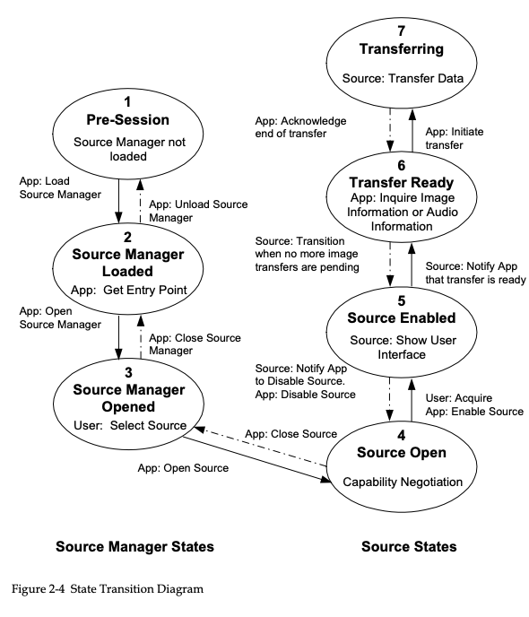
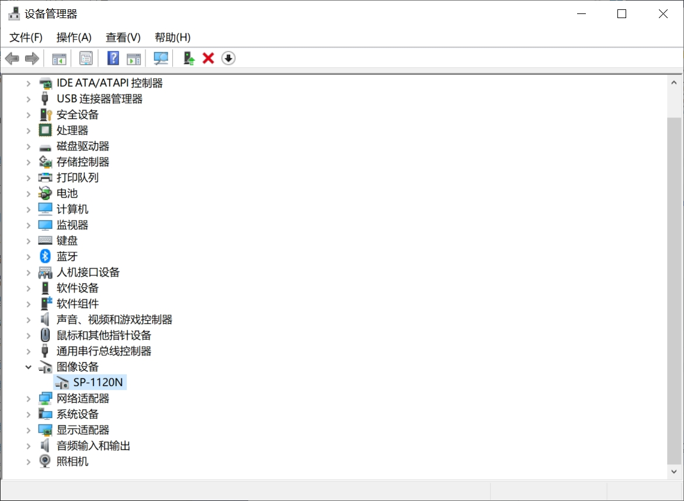

# node-twain

A nodejs library for TWAIN using node-addon-api.

NOTE: Project is under develop. PR is welcomed, any issue is welcomed.

## Installation
``$ npm install node-twain``

## Twain flow


## Usage

```typescript
import {twain} from "node-twain"

const app = new twain.TwainSDK( {
    productName: "productName!",
    productFamily: "productFamily!",
    manufacturer: "manufacturer!",
    version: {
        country: twain.TWCY_CHINA,
        language: twain.TWLG_CHINESE,
        majorNum: 1,
        minorNum: 1,
        info: "v0.0.1",
    }
})
const sources = app.getDataSources()            // ["PaperStream IP SP-1120N #2"]
const defaultSource = app.getDefaultSource()    // "PaperStream IP SP-1120N #2"
app.setDefaultSource(sources[0])    //set which scanner to work

await app.openDataSource(defaultSource) //args 

const enumTest = app.getCapability(twain.ICAP_XFERMECH)         // Enum
const oneValueTest = app.getCapability(twain.CAP_AUTHOR)        // one value
const rangeTest = app.getCapability(twain.ICAP_JPEGQUALITY)     // range
const arrayTest = app.getCapability(twain.CAP_SUPPORTEDCAPS)    // array

session.setCallback()
app.scan(twain.TWSX_FILE, fileName);  //fileName:Full path
```

## Data Source Support
According to [twain‘s github](https://github.com/twain/twain-dsm/blob/master/TWAIN_DSM/README.txt),
Data Source Manager looks for data sources in

|OperaSystem|directory|
|---|---|
|windows|C:\Windows\twain_32 C:\Windows\twain_32|
|Linux | /usr/local/lib/twain|
|MacOS| /Library/Image Capture/TWAIN Data Sources|

Install your scanner driver and confirm whether your scanner support TWAIN or not.

## License
MIT License. See the LICENSE file.


## Setup Develop Environment

### Windows

- Python is required for node-gyp is used to build package.

- Vitual Studio is required.

Steps

1. Confirm Twain Datasource Manage is supported. Checkout this directory:

```
C:\Windows\System32
```

If there is no file "TWAINDSM.dll", copy the "TWAINDSM.dll" file into the System32 directory.


2. Confirm the scanner driver is installed.
For example, my scanner is SP-1120N.

**PS: The scanner MUST support TWAIN protocal.**




3. Run the test script

```
npm run test
```

This command will search *.test.js, then run the `twain.test.js` script.
